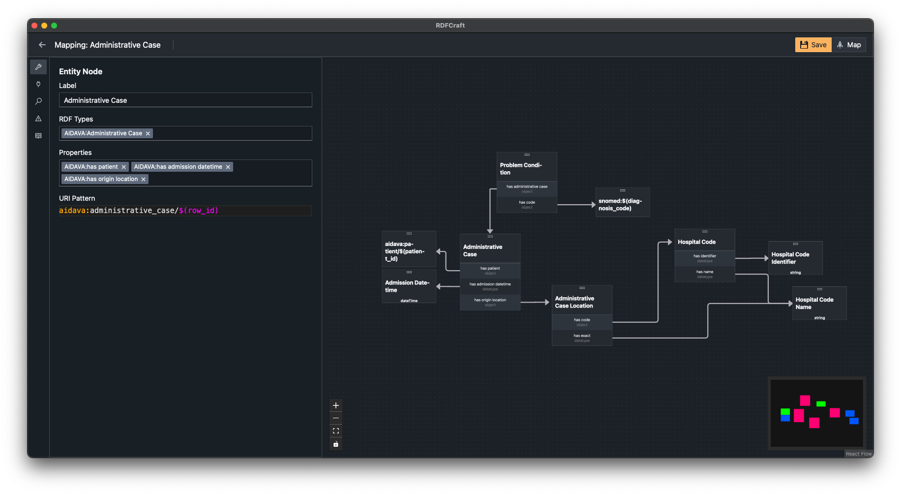

# RDFCraft

RDFCraft is a tool for mapping csv/json data to RDF with an easy to use GUI. It
uses FastAPI for the backend, React for the frontend and everything packed in a
single executable using Nuitka.



## Features 🌟

- **Easy to use GUI**: Just upload your csv/json file and start mapping your
  data to RDF.

- **Ontology Indexing**: It indexes all the classes and properties from the
  provided ontology and provides recommendations while mapping.

- **Source Indexing**: It indexes all the columns from the provided csv/json
  file and provides recommendations while mapping.

- **Auto Completion**: It provides auto completion while creating URIs for
  entities.

- **Multiple file formats**: Supports both csv and json file formats.

- **Multiple RML formats**: It generates both YARRRML and RML mappings.

## Requirements 📦

- Latest Java Runtime Environment (JRE) or Java Development Kit (JDK) to use the
  [RMLMapper](https://github.com/RMLio/rmlmapper-java)
  - This is required to generate RML mappings.

## Installation 🚀

From [Releases](https://github.com/MaastrichtU-IDS/RDFCraft/releases) page,
download the latest release for your OS and extract the contents if it is
compressed. Run the executable and you are good to go.

> [!WARNING]
>
> On macOS, because app is not notarized by Apple, you need to run following
> command to bypass the gatekeeper:
>
> ```bash
> xattr -rd com.apple.quarantine </path/to/RDFCraft.app>
> ```
>
> More information about gatekeeper can be found
> [here](https://support.apple.com/en-us/HT202491).

## Getting Started 🚦

You can find a detailed guide on how to use RDFCraft in the
[Guide](guide/guide.md) section.

## Development 🛠

1- Clone the repository:

```bash
git clone git@github.com:MaastrichtU-IDS/RDFCraft.git
```

2- Install the dependencies for the backend:

- If you have `just` installed:

```bash
just install-dev
```

- Otherwise:

```bash
uv sync --all-extras --dev
```

3- Install the dependencies for the frontend:

```bash
cd app
npm install
```

4- Create `.env` file in the root directory and add the following:

```bash
DEBUG=1
```

5- Start the backend

6- Start the frontend

```bash
cd app
npm run dev
```
