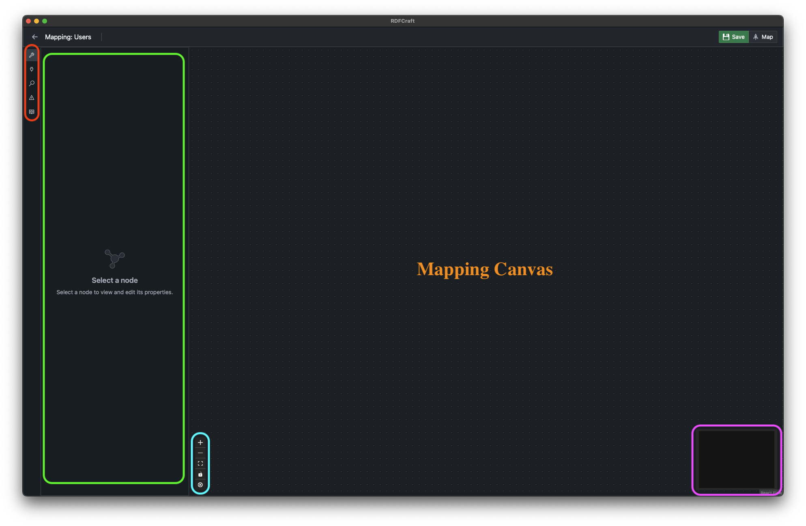
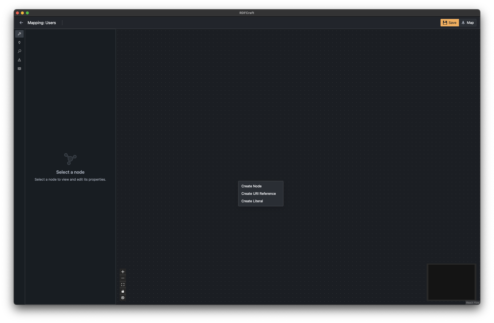
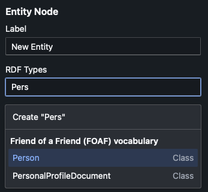
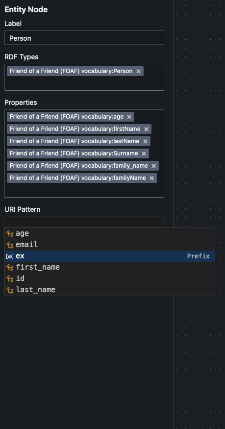
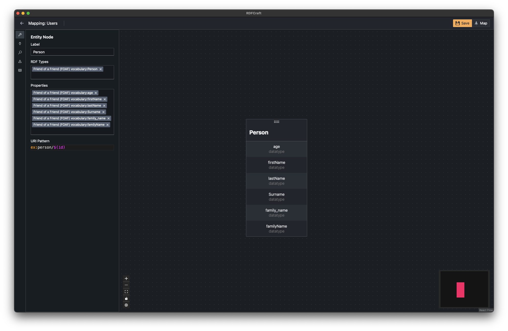
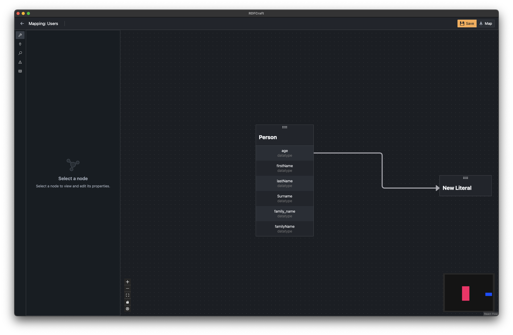
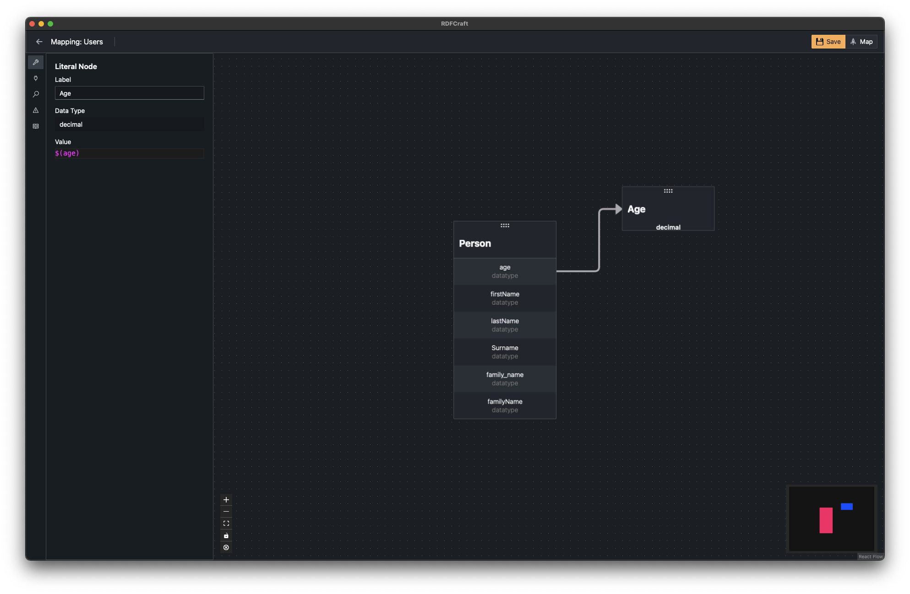

# Mapping Interface

Now that you have created a workspace, imported the ontologies you need, and
added prefixes you will use, and created a mapping, you can start mapping your
data. Simply click on the **Open** button on the mapping you want to work on.



You will see a screen like the one above. This is the mapping interface.

- The red box is the **Tabs** section. You can switch between different tabs
  using this section. The tabs are:

  - **Entity Properties**: This tab shows the properties of selected entity. Via
    this tab, you can add classes, properties to entity. Change its label and
    define its URI Pattern.
  - **AI**: This tab shows the AI recommendations for the mapping. You can
    accept or reject the recommendations. (Work in progress)
  - **Search**: This tab allows you to search the entities in you mapping.
  - **Problems**: This tab shows the problems in your mapping. You can click on
    the problem to see the details.
  - **References**: This tab shows the references (column names/keys) in your
    source file.

- The green box is Side Panel. This panel is collapsible and its width can be
  adjusted. It shows the tab selected in the red box.

- In the middle where it says **Mapping Canvas**, is where you will do the
  actual mapping. You can **Right Click** on the canvas to add a new node,
  literal or URI Reference.

- The blue box is the **Mapping Toolbar**. This toolbar contains the buttons:

  - **Zoom In**
  - **Zoom Out**
  - **Fit to Screen**: It fits the mapping canvas to the screen.
  - **Lock/Unlock**: It disables/enables the ability drag and drop entities on
    the canvas.
  - **Delete**: It deletes the selected entity.

- The purple box is the **Mini Map**. It shows the whole mapping canvas in a
  small scale. You can use it to navigate the canvas.

- On top right corner, you can see the **Save** and **Map** buttons. **Save**
  button saves the mapping and **Map** button generates the RML mapping.

> [!Warning]
>
> System does not save the mapping automatically. You need to click on the
> **Save** button to save the mapping. It is color coded. If it is orange, it
> means you have not saved the mapping.
>
> Also to **Map** the mapping, you need to save it first.

## Creating Nodes

To create a node, right click on the canvas and select **Create Node**. It will
create a new Node in the canvas.




After you create a node, you can click on the node to see the properties of the
node on the **Node Properties** panel.


- **Label**: The label of the node. It is only used to increase the readability
  of the mapping. It is not used in the actual mapping process.

- **RDF Types/Properties**: The RDF types and properties of the node. You can
  add multiple RDF types/classes and properties to a node.

  After you click on the text box, you will see a dropdown list of classes from
  the ontologies you have imported. You can select one or more classes from this
  list.

  This dropdown also shows the classes/properties that is best matched with the
  existing connections.

  If you don't have the class you want to use in the list, you can type the URI
  and click **Create ...** option.




- **URI Pattern**: The URI pattern of the node. URI patterns are used to
  generate unique URIs for unique entities. This field supports auto complete
  and you can access it using `Ctrl + Space` (or `Cmd + Space` on Mac).

  You can use the prefixes you have added in the workspace in the URI pattern.
  You can use references (column names/keys) in the source file in the URI with
  following syntax:

  ```
  $(reference_name)
  ```

  At the end these references will be replaced with the actual values in your
  data.




After you have added the classes, properties, and URI pattern, you should have a
node like this:



## Creating Connections

To create a connection between two nodes, you can drag from a property of a node
to head of another node. (or vice versa).

You can also quickly create nodes and connections by dragging from a property of
a node and dropping it on the canvas. It will create show you the options to
create either a new node, literal or URI reference.




You can again click on the newly created node to see and edit its properties.



You can continue creating nodes and connections until you have mapped all your
data.

You can check which references you have used in the mapping by clicking on the
**References** tab. (Work in progress)
