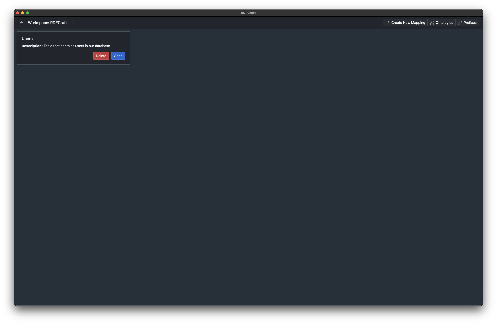

# Mappings and Sources

RDFCraft only supports a single source file per mapping. However, you can create multiple mappings in a designated workspace and draw connections between manually.

> [!Note]
>
> We have enforced this is an arbitrary limitation for the
> following reasons:
>
> - We wanted to keep the mapping interface simple and easy to use.
> - We wanted to keep the mapping process as simple as possible.
> - In our use cases, we observed that many RML engines struggles/takes
>   a long time to process multiple sources. Usually it is much faster to create
>   the connection manually.

## Creating a mapping

After you open your workspace, click on the **Create New Mapping** button 
on the right top corner of the screen to create a mapping. You will be prompted to
enter the details of the mapping.


- **Name**: The name of the mapping.
- **Description**: A brief description of the mapping.
- **Type**: The type of the source file. You can choose either **CSV** or
  **JSON**.
- **JSON Path**: For RML mappings to work with JSON files, you need to provide a
  JSON Path that leads to the array of objects in the JSON file. This is not
  required for CSV files. You can use the
  [JSON Path Tester](https://jsonpath.com/) to test your JSON Path. Also at the
  end of this page, you can find examples of JSON Path.
- **File**: The path of the source. You can browse your computer for the appropriate file.

After you enter the details, click on the **Create** button to create the
mapping.



## JSON Path Examples

If the array you would like to map is at the root of the JSON file, you can use

```jsonpath
$.
```

on the JSON Path field.

If the array you would like to map is nested inside an object, like the
following JSON:

```json
{
  "people": [
    {
      "name": "Alice",
      "age": 25
    },
    {
      "name": "Bob",
      "age": 30
    }
  ]
}
```

In this case, you should use the following JSON Path:

```jsonpath
$.people[*]
```

This JSON Path will lead to the array of objects in the JSON file.

[Previous: Ontologies](/guide/prefixes.md) |
[Next: Mapping Interface](/guide/mapping-interface.md) []: # (end)
